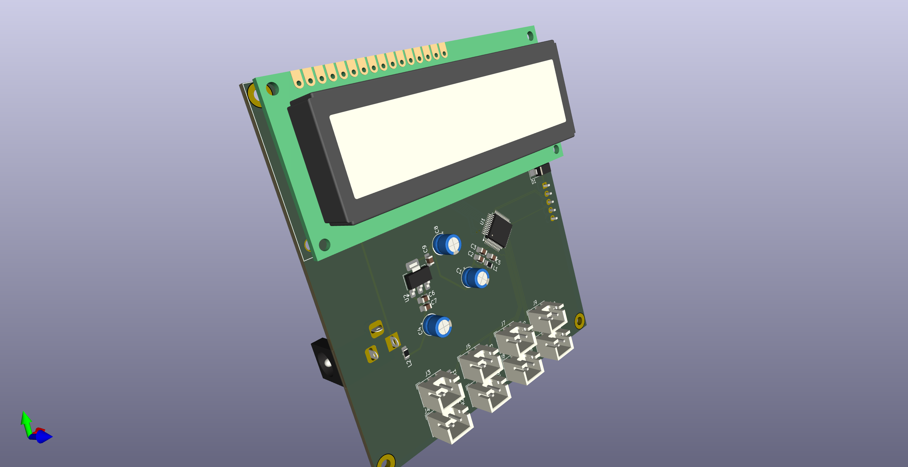

# STM32G0-based Temperature Test Jig PCB

This repository contains the design and manufacturing files for a temperature test jig PCB based on the STM32G0 microcontroller, featuring a 16×2 LCD and 8 thermistor sensors.

### Project Structure

The project is organized into the following directories:

- `Design/`: Contains the KiCad design files.
    - `test-jig-temperature-pcb.kicad_pcb`: PCB layout file.
    - `test-jig-temperature-pcb.kicad_pro`: Project file.
    - `test-jig-temperature-pcb.kicad_sch`: Schematic file.
- `Docs/`: Documentation for the project.
    - `Schematic.pdf`: PDF version of the schematic.
- `Images/`: Images related to the project.
    - `Front.png`: Front view image.
